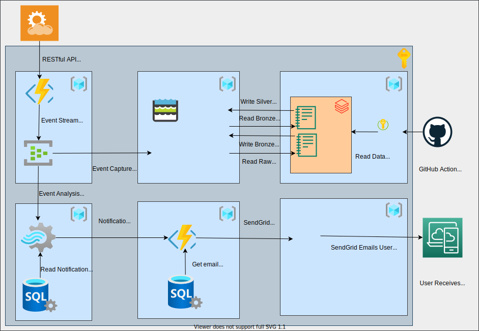

# Azure Data Engineer DP-203 Prep

A repo with notes and links to repos that contain examples of the resources encapsulated in the Azure Data Engineer (DP-203) course.

## A Typical Data Management Platform Design

## Data Engineering Use Case

In order to better learn and understand the concepts and resources encompassed in the DP-203 Microsoft certifcation exam, I have come up with a real world data engineering use case as described below.

### Use Case

You are a cloud data engineer at a wealth management company.  The company is beginning to include crypto currencies within their wealth management portfolio.  As part of this initiative the company needs a system to track crypto currency prices and create alerts when certain price thresholds have been hit or when the system detects a good buy opportunity.

### User Narratives

    As a crypto trader
    In order to improve crypto trading gains
    I want a system to notify me when a crypto currency has reached predefined price thresholds (low and high)

    As a crypto trader
    In order to improve crypto trading gains
    I want a system to provide insights on crypto currencies to purchase due to their price trends

### System Architecture

There is a RESTful API that allows clients to request crypto currency pricing in realtime and on a frequent basis.

We will convert the results from the crypto currency API into a data stream and then do real-time analysis on the data stream as well as capture the events into a data lake for near real-time analysis.

Below is a diagram of the system design for accomplishing these goals.

In this design, the 3 main processing components have been decoupled and the resources for each processing component are housed in seperate Resource Groups and GitHub Repos.

1. [Data Streaming](https://github.com/michael-griehm/azure-data-streams)
2. [Data Lake](https://github.com/michael-griehm/azure-data-lake)
3. [Data Processing, Refinement, and Analysis](https://github.com/michael-griehm/azure-databricks)

## Concepts

### ETL vs. ELT

- Extract Transform Load
  - Transform data before it is persisted to data store.
  - Not good for big data, especially if not all the data needs to be analyzed and transformed.
  - Generally used with SQL Server, possibly also with Azure Synase Data Pool (Azure SQL DW)
- Extract Load Transform
  - Get data in its raw state into a storage zone, then analyze and transform only the data needed for a report, decision model, etc...
  - When you want to store exabytes of data for latter analysis and unknown purposes.
  - Generally used with Azure Data Factory & Azure Data Lake Gen 2.  USe Data Factory's 90+ data source providers to move data from source into Data Lake into the Raw data zone.  Then use Data Factory and/or Data Bricks to transform and place into the Bronze, Silver, and Gold zones and hierarchies.

### The CAP Theorem

In theoretical computer science, the CAP theorem, also named Brewer's theorem after computer scientist Eric Brewer, states that any distributed data store can only provide two of the following three guarantees:

- Consistency
  - Every read receives the most recent write or an error.
- Availibility
  - Every request receives a (non-error) response, without the guarantee that it contains the most recent write.
- Partition Tolerance
  - The system continues to operate despite an arbitrary number of messages being dropped (or delayed) by the network between nodes.

When a network partition failure happens, it must be decided whether to:
  
- cancel the operation and thus decrease the availability but ensure consistency 
or
- proceed with the operation and thus provide availability but risk inconsistency

Thus, if there is a network partition, one has to choose between consistency and availability. Note that consistency as defined in the CAP theorem is quite different from the consistency guaranteed in ACID database transactions.

Eric Brewer argues that the often-used "two out of three" concept can be somewhat misleading because system designers only need to sacrifice consistency or availability in the presence of partitions, but that in many systems partitions are rare.

### Batch Processing

A method for running high volume, repetetive jobs.

### Stream Processing

