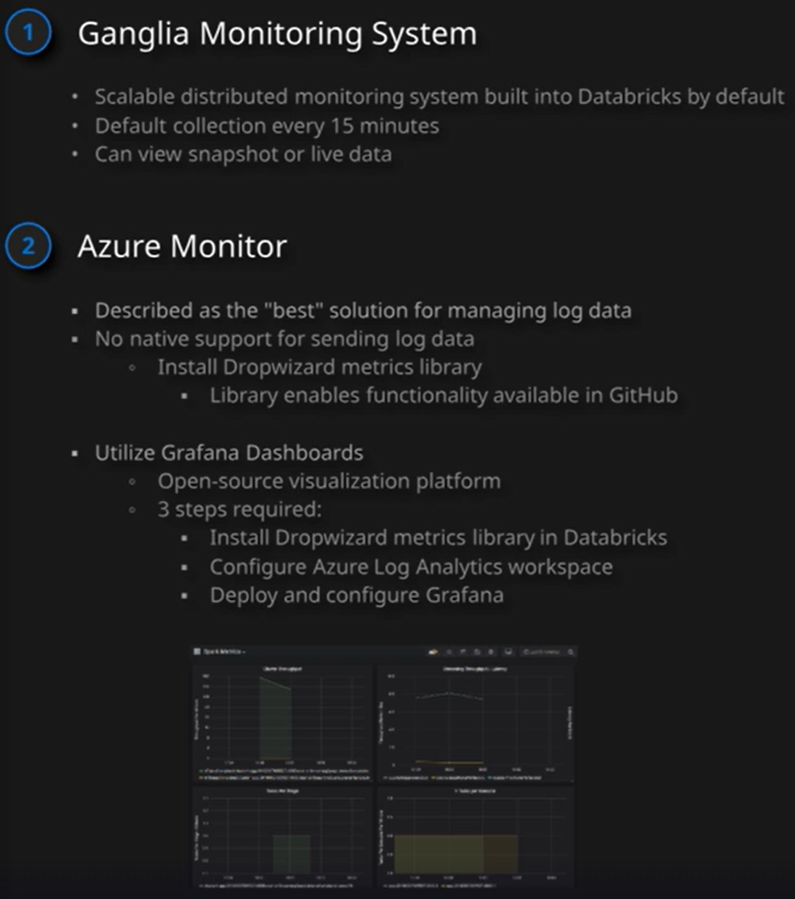

# databricks

Primarily a transformation service.  Transform data of any large size.

- Ensure value consistency
- Remove zeros or blank rows
- Cleanse dates

## Monitoring

## Managed Identity thru Azure Data Factory Integration

Info on this [here](https://techcommunity.microsoft.com/t5/azure-data-factory-blog/azure-databricks-activities-now-support-managed-identity/ba-p/1922818)
