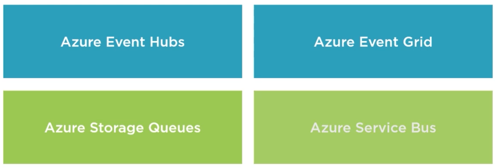
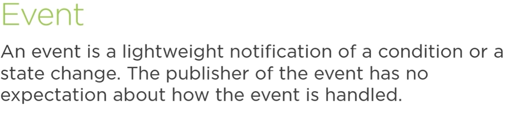
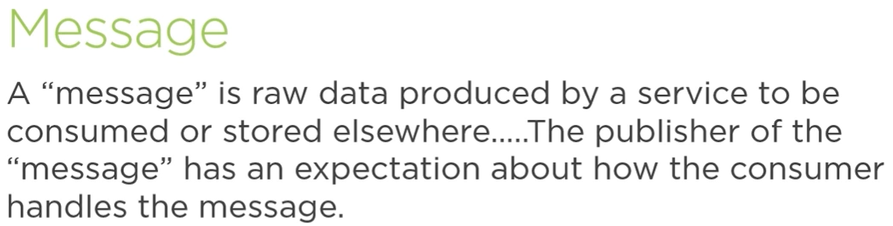
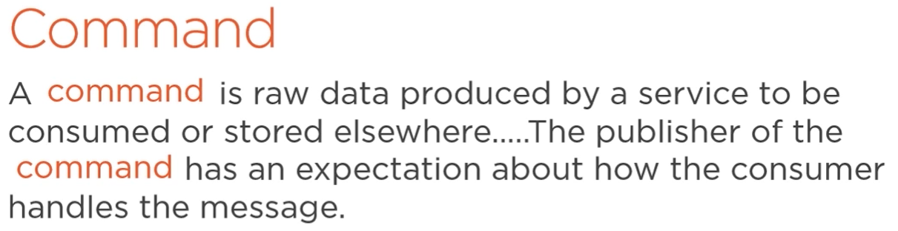
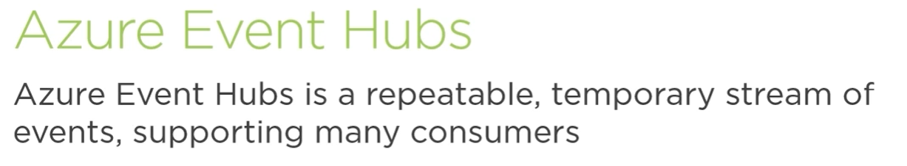
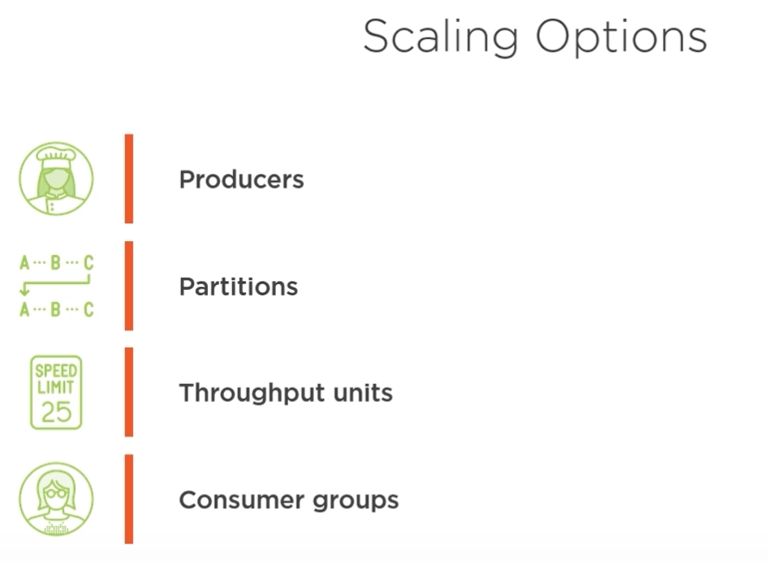
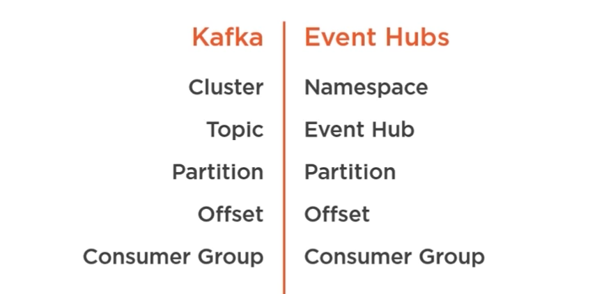

# Azure Event Hub

## Azure Event/Messaging Solutions

### Event

1 MB size at most for Event Hub.

Lack of expectations allows an event to be read multiple times and by multiple different consumers.

### Message (i.e. Command)

80 GB for Azure Storage Account Queues.

Ensure the Message/Command is only read once (queue), or once by each subscriber (topic).

### Event/Messaging Principles

- Decoupling: Reduce fragility of infrstrucutre.  Decouple time or timing of productiong to consumption of event/message.
  - Storage Queues
  - Event Grid
- Scalability: Spread out the work to multiple nodes but we lose gaurantees, speed comes at a cost of both resources and reliability.
  - Event Hubs
- Reliability: Control how many time an event/message gets read.  Gaurantee messages do not get dropped.  Longer retention times.
  - Service Bus 

### Event Hub Architecture

- Producer: Creates Events.
- Event Hub: Event conveyor belt, Consumer grabs the Events they are concerned about.
  - Stores Events for 1 to 7 days, Retention Period.
  - Enable Data Capture to store events in either Blob Storage or Data Lake.
- Consumer: Acts on the Event.
  - Is assigned to a particular Partition.
  - Events are stored in their Offset order, Offset stored as bytes.
  - Consumes messages based upon the Consumer's Offset number.

## Summary

Repeatable, can replay a series of events.
Temporary, retention period
Many Consumers, at least once read methodology.  

## Scaling

### Scaling Out

More Partitions for more Producers.  2 to 32 Partitions configured at creation and cannot change.

Increase throughput, at the Event Hub Namespace level you can increase the number of throughput units, each unit ~ 1 MB Ingress/Second & 2 MB Egress/Second.

Multiple Consumers in a single Consumer Group, share the same Offset.

### Partition Keys

Organize data thru a Partition based upon an aspect of the event data.  Can unbalance the throughput of Partitions in an Event Hub.

### Messaging Protocols

#### Publishing

- HTTPS: widely understood and used.
- Kafka: 
- AMQP: Advanced Message Queueing Protocol (should be default choice with Azure Event Hub)

### What is an Event?

Picture, text, etc...

- Event Body: stream of raw bytes
- Properties: headers/metadata

### What is Apache Kafka?

Popular open-source event platform created by LinkedIn and donated to the Apache Software Foundation.

#### Protocol

Covers how the endpoints work and operate.

#### Infrastructure

The servers and software that handles the events.

### Azure Event Hub supports the Kafka Protocol

#### Similarities

- Designed for Events
- At-least-once messaging
- Partitions
- Ordering within a partition

##### Naming

#### Differences

- Fixed Partitions in Event Hub
- Retention Period is limited to 1 or 7 days in Event Hub
- PaaS for Event Hub vs. Kafka locally hosted