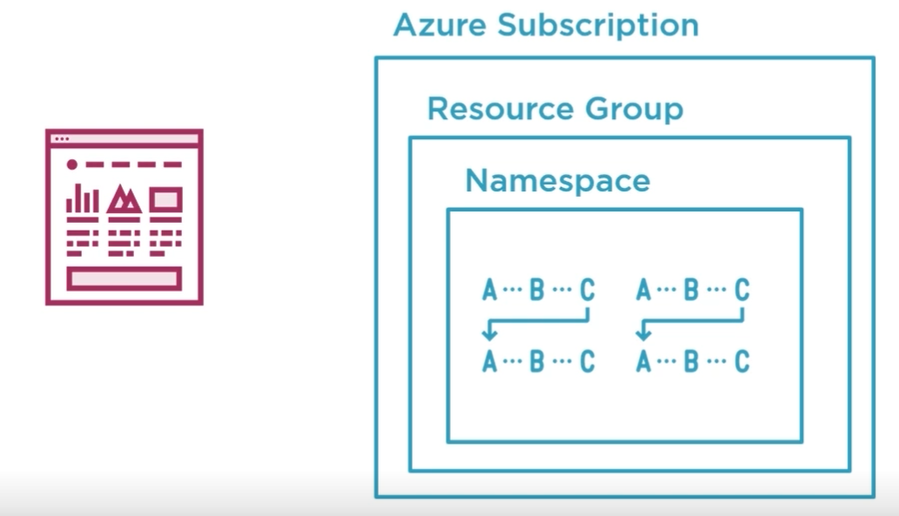
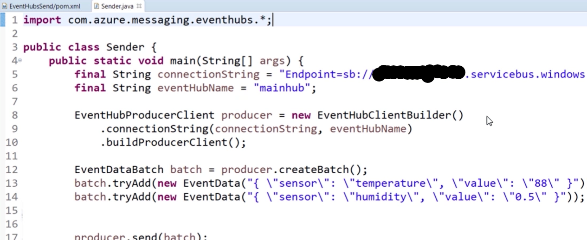

# Azure Event Hub

## Data Engineering Pipeline

- Ingest - Event Hubs
  - Dedicated solution on how to recieve millions of events.
- Analyze - Stream Analytics
  - Applying business logic to the data and possibly reaching some conclusion.
- Deliver - Power BI
  - Get the results to the end user
    - Data Scientist
    - Business Users
    - Application Users

## Azure Event/Messaging Solutions

### Event

1 MB size at most for Event Hub.

Lack of expectations allows an event to be read multiple times and by multiple different consumers.

### Message (i.e. Command)

80 GB for Azure Storage Account Queues.

Ensure the Message/Command is only read once (queue), or once by each subscriber (topic).

### Event/Messaging Principles

- Decoupling: Reduce fragility of infrstrucutre.  Decouple time or timing of productiong to consumption of event/message.
  - Storage Queues
  - Event Grid
- Scalability: Spread out the work to multiple nodes but we lose gaurantees, speed comes at a cost of both resources and reliability.
  - Event Hubs
- Reliability: Control how many time an event/message gets read.  Gaurantee messages do not get dropped.  Longer retention times.
  - Service Bus 

### Event Hub Architecture

- Producer: Creates Events.
- Event Hub: Event conveyor belt, Consumer grabs the Events they are concerned about.
  - Stores Events for 1 to 7 days, Retention Period.
  - Enable Data Capture to store events in either Blob Storage or Data Lake.
- Consumer: Acts on the Event.
  - Is assigned to a particular Partition.
  - Events are stored in their Offset order, Offset stored as bytes.
  - Consumes messages based upon the Consumer's Offset number.

## Summary

Repeatable, can replay a series of events.
Temporary, retention period
Many Consumers, at least once read methodology.  

## Scaling

### Scaling Out

More Partitions for more Producers.  2 to 32 Partitions configured at creation and cannot change.

Increase throughput, at the Event Hub Namespace level you can increase the number of throughput units, each unit ~ 1 MB Ingress/Second & 2 MB Egress/Second.

Multiple Consumers in a single Consumer Group, share the same Offset.

### Partition Keys

Organize data thru a Partition based upon an aspect of the event data.  Can unbalance the throughput of Partitions in an Event Hub.

### Messaging Protocols

#### Publishing

- HTTPS: widely understood and used.
- Kafka: 
- AMQP: Advanced Message Queueing Protocol (should be default choice with Azure Event Hub)

### What is an Event?

Picture, text, etc...

- Event Body: stream of raw bytes
- Properties: headers/metadata

### What is Apache Kafka?

Popular open-source event platform created by LinkedIn and donated to the Apache Software Foundation.

#### Protocol

Covers how the endpoints work and operate.

#### Infrastructure

The servers and software that handles the events.

### Azure Event Hub supports the Kafka Protocol

#### Similarities

- Designed for Events
- At-least-once messaging
- Partitions
- Ordering within a partition

##### Naming

#### Differences

- Fixed Partitions in Event Hub
- Retention Period is limited to 1 or 7 days in Event Hub
- PaaS for Event Hub vs. Kafka locally hosted

## Event Hub Sizing

- Pricing Tier
  - Basic
  - Standard, twice as expensive as basic but includes:
    - Data Capture Storage
    - Kafka support
    - Retain events for up to 7 days instead of 1 day (Default is 7)
  - Dedicated, costs ~> $4k a month
    - Higher Ingress and Egress
    - Up to 90 days of event retention
- Throughput Units
  - 1 MB Ingress per second
  - 2 MB Egress per second
- Zone Redundancy

Namespaces manage cost and access.

### How Many Partitions?

2 to 32, one Partition per Reader.

Default number is 4 Partitions.

## Sending and Recieving Messages

### Requirements

## Azure Monitor

### Types of Metrics

- Connections
- Requests
- Errors
- Messages and bytes
- Data capture

## Data Capture

Aspects to configure for Data Capture.

- Size Window
- Time Window
- Folder Format

Whichever wins first.

- Stored in Avro File Format
  - Compact binary format
  - JSON headers to define the shape of the data
  - Designed for data serialization
  - Made for Apache Hadoop ecosystem
  - Also used in Azure Stream Analytics and Azure Data Factory

### Storage Options

- Blob Storage 
- Data Lake Gen 2 (which is a thin layer on top of Blob storage)

#### Blob

Binary Large Object solution for the cloud optimized for storing massive amounts of unstructured data. (Terrabyte and Pedabyte)

- Storage Account
  - Provides an Endpoint and Namespace
- Container
  - A File Folder
- Blob
  - File

##### Blob Types

- Block Blobs
  - Data is stored as blocks
  - Made for uploading large files
  - Parallel uploading and MD5 hashes to ensure the integrity of the data
  - From 4 MB to 100 MBs
- Append blob
  - Only append operations for things such as logs
  - Max size 4 MBs
- Page Blobs
  - Made for random read/write access such as the disks in Virtual Machines
  - 520 bytes

##### Data Redundancy

- Locally Redundant (LRS)
  - Saved three different places within the same data center
  - Cheapest and least reliable
- Zone Redundant (ZRS)
  - Saved in three seperate data centers (Availability Zones) within the same region (location)
  - Default recommendation, access data quickly and be sure it is safe
- Geo Redundant (GRS)
  - Asynchronously copy your data to a whole different region (location)
  - Protects against vast natural disasters

#### Data Lake

Azure Data Lake Storage Gen2 is a set of capabilities dedicatdd to big data analytics built on Azure Blob Storage. 

The Data Lake is split up into to parts:

- Storage
  - Storage capability of files.
- Analytics
  - Tool used to run large analytics on large amounts of data using massive parallel processing.
  - Databricks is a competitor to this feature set and long term support for this is unknown.

##### Benefits

- Built on Blob Storage
- Hadoop compatible access (being replaced with Apache Spark)
- Hierarchical namespace (file directory structure)
- Cheaper, Gen 2 ZRS is 40% cheaper Gen Data Lake Storage

## Streaming Analytics

The analysis of huge pools of current and "in-motion" data thru the use of continous queries called event streams.

### Criteria

- Real-time
- Urgent and expiring
- Windows of time
- Complex Event Processing

### Tools

- Azure Stream Analytics
  - Can process streams
- Azure Databricks

#### Azure Stream Analytics (ASA)

SQL-like tool that understands time and window-based analysis.

- PaaS
- Scalable
  - Measured in arbitrary Streaming Units
  - 1 Streaming Unit ~ 1 Mb/s
  - Can scale up to 100's of Streaming Units
- Fast
  - Can handle millions of events at sub-second latencies

ASA is not a full solution.  A tool for a narrow purpose.

#### Azure Databricks

Managed, centralized solution for advanced analytics.

It is a layered product:

1. Apache Spark
   - Engine that powers Azure Databricks
   - Open source program originally created at UC Berkley and is now maintained by the Apache software foundation
