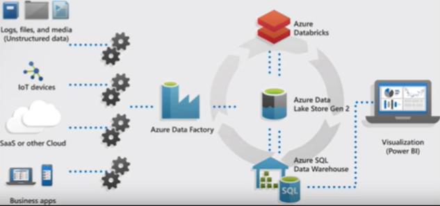

# Cloud Data Warehousing in Azure Synapse Analytics Overview

- Ingest
- Prepare
- Manage
- Serve

Azure Synapse Analytics combines the following Azure Resources together to provide enterprise grade data modeling and analytics solutions for big data:

- Azure Data Factory Pipelines
- Azure Data Lake Storage
- Azure SQL Data Warehouse
- Azure Analytics

Azure Synapse Analytics allows organizations to utilize the following Azure Resource effectively:

- Power BI
- Azure Machine Learning

Benefits:

- Limitless Scale
- Useful Insights
- Unified Experience
- Code-free Ability
- Data Security
- Enterprise Data Warehousing

## Azure Synapse Workspace

The development and management user interface is the Azure Synapse Workspace.

It contists of 5 activity Hubs:

- Data
- Develop
  - Create the following type of development artifacts
    - SQL Script
    - Notebook
    - Data flow
    - Apache Spark job definition
- Integrate
- Monitor
- Manage

## Azure SQL Data Warehouse (Azure Synapse Pool)

Enterprise Data Warehouse (EDW) that uses Massively Parallel Processing (MPP) to run complex queries across patabytes of data quickly.

### When to Use

When you need/want to keep historical data seperate from source transcational data/system to prevent from interfering with the performance of the transactional systems.

Lots of historical data you want to run complex queries upon.

### Benefit

- Independently size compute power regardless of storage needs
  - Compute Nodes and Storage Nodes are seperate
  - Move the compute power to the data
  - Pause compute capacity while leaving data intact, so you only pay for storage during off hours
  - Resume compute capacity during operational hours

### Massive Parallel Processing

MPP Engine is split up into 60 different nodes for processing.

- Control Node: The endpoint that interacts with all applications and connections.  The MPP Engine control process runs on the Control Node and optimizes and coordinates the execution of parallel queries.
- Compute Nodes: Provide the computational power for the analytics.  Seperate from storage nodes.  These are scaled using Data Warehouse Units (DWU).
- DWU: Collection of analytic resources that are previsioned.  CPU, Active Memory, and IO.  Can scale up and down.
- Data Movement Service (DMS):  Coordinates data movement between compute nodes.  When SQL Data Warehouse runs a query, the work is devided into 60 smaller queries that run in parallel.
- Storage Node: Kept seperate from Compute in order to keep data at rest.  Data at rest is cheaper than data that is being analyzed.

### Data Distributions

- A 'Data Distribution' is the basic unit of storage and processing for parallel queries.
- Rows are stored across 60 Distributions which are run in parallel.
- Each Compute Node manages one or more of the 60 Distributions.

#### Data Distribution Types

- Replicated Tables: caches a full copy on each compute node.  Used for small tables.
- Round Robin:  distributes data evenly across the compute nodes without additional optimization.  Joins require reshuffling data.  Is the Default distribution type.
- Hash Distributed: A hash function is used to assign each row to a compute node deterministically.

#### What Data Distribution to Use?

### Data Partitions

- Enable you to divide the data into smaller groups of data.
- Improve the efficiency and performance of loading data by use of partition deletion, switching, and merging.
- Usually data is partitioned on a date column tied to when the data is loaded into the database.
- Can also be used to improve query performance by only traversing relevant rows during a query.

#### Data Partition Types

#### Data Partition Considerations

#### Sizing Partitions

